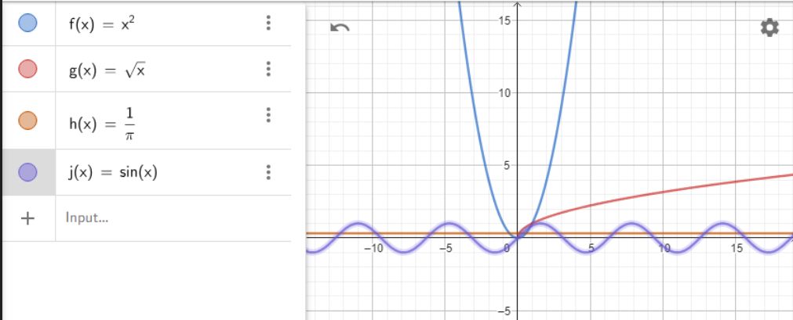
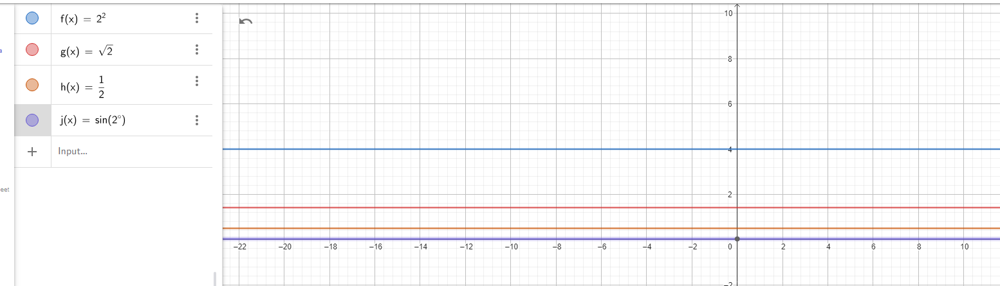
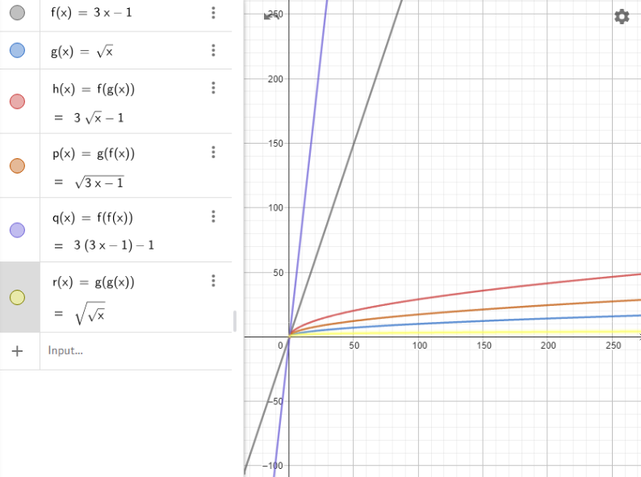
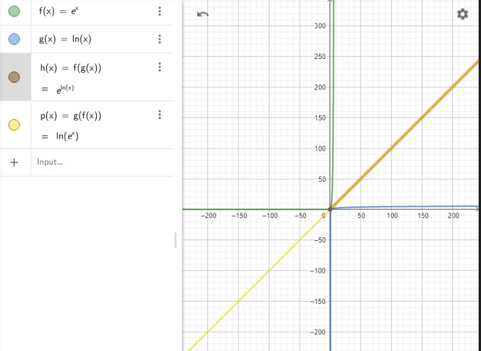
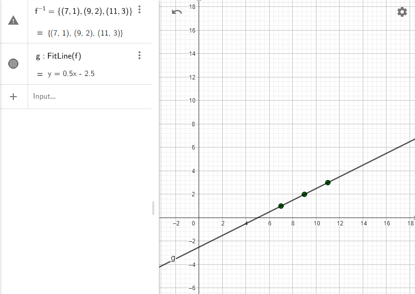
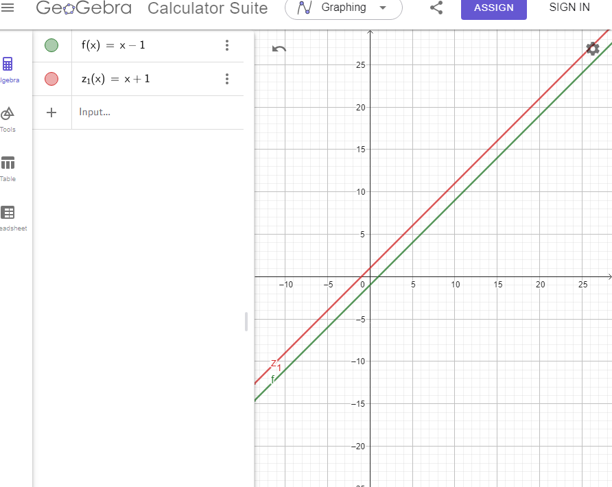

# 18. Functions
# 1. Draw in a single Geogebra notebook the following functions.

# Find the value of all above functions at x=2

# 2. Let 
$$f(x) = 3x - 1$$
# And
$$g(x) = \sqrt{x}$$

### 3: Check $$f(g(x))$$ and $$g(f(x))$$
We are given:
$$f(x) = e^x \quad \text{and} \quad g(x) = \ln(x)$$

#### Step 1: Compute $$f(g(x))$$
Substitute $$g(x) = \ln(x)$$ into $$f(x)$$:
$$f(g(x)) = f(\ln(x)) = e^{\ln(x)}$$

Using the property of logarithms and exponentials:
$$e^{\ln(x)} = x \quad \text{(for } x > 0\text{)}$$

Thus:
$$f(g(x)) = x \quad \text{(for } x > 0\text{)}$$

#### Step 2: Compute $$g(f(x))$$
Substitute $$f(x) = e^x$$ into $$g(x)$$:
$$g(f(x)) = g(e^x) = \ln(e^x)$$

Using the property of logarithms:
$$\ln(e^x) = x$$

Thus:
$$g(f(x)) = x \quad \text {(for all } x\text{)}$$

#### Conclusion:
For $$f(x) = e^x$$ and $$g(x) = \ln(x)$$:

$$f(g(x)) = x \\quad \\text{(for } x > 0\\text{)}$$  
$$g(f(x)) = x \\quad \\text{(for all } x\\text{)}$$

This shows that $$f(x)$$ and $$g(x)$$ are inverses of each other.

### 4: Find $$f^{-1}$$ for $$f = \{(1, 7), (2, 9), (3, 11)\}$$
#### Step 1: Understand the Inverse Function
The inverse of a function swaps the input and output. For example, if $$f(a) = b$$, then $$f^{-1}(b) = a$$.

#### Step 2: Swap the Pairs
Given $$f = \{(1, 7), (2, 9), (3, 11)\}$$, the inverse function is:
$$f^{-1} = \{(7, 1), (9, 2), (11, 3)\}$$

**Final Answer:**
$$f^{-1} = \{(7, 1), (9, 2), (11, 3)\}$$

###  5: Find $$f^{-1}$$ for $$f = \{(1, 7), (2, 7), (3, 11)\}$$
#### Step 1: Check if the Function is Invertible
For a function to have an inverse, it must be one-to-one (each output corresponds to exactly one input **and each input corresponds to exactly one output**).

### **Given Function:**
$$f = \{(1, 7), (2, 7), (3, 11)\}$$

#### **Step 1: Check One-to-One Property**
- Observe:
  - 1 maps to 7.
  - 2 also maps to 7.
  - 3 maps to 11.

Here, we see that **1 and 2 both map to the same output (7)**. This means the function is not one-to-one. If an output corresponds to multiple inputs, the function cannot have an inverse.

#### **Conclusion:**
Since the function is not one-to-one, its inverse $$f^{-1}$$ cannot be defined.

### 6: Find $$f^{-1}$$ for $$f(x) = x - 1$$
#### Step 1: Write the Equation for the Inverse
To find the inverse of $$f(x) = x - 1$$, we solve for $$x$$ in terms of $$y$$:
$$y = x - 1$$

Switch $$x$$ and $$y$$:
$$x = y - 1$$

Solve for $$y$$:
$$y = x + 1$$

Thus, the inverse function is:
$$f^{-1}(x) = x + 1$$

#### Step 2: Plot Both Functions
To visualize, we plot:
1. $$f(x) = x - 1$$
2. $$f^{-1}(x) = x + 1$$

Both functions should be symmetric about the line $$y = x$$. 

### 1. Limit Calculation:
**The requested limit:**
$$
\lim_{n \to \infty} \frac{n^2 + 3n}{n^2 - 2n}
$$

The basic approach used in this type of limit is to use the "largest degree term" to simplify the numerator and denominator. Since as
$$
\lim_{n \to \infty} 
$$
  the largest degree term dominates the other smaller terms. Here, the largest degree term in both the numerator and the denominator is \(n^2\).

**Steps:**

Divide both the numerator and denominator by the largest degree term, which is \(n^2\). So we have:
$$
\frac{n^2 + 3n}{n^2 - 2n} = \frac{\frac{n^2}{n^2} + \frac{3n}{n^2}}{\frac{n^2}{n^2} - \frac{2n}{n^2}} = \frac{1 + \frac{3}{n}}{1 - \frac{2}{n}}
$$

When 
$$
\lim_{n \to \infty} 
$$, 

Examine the limits of the smaller terms:  
$$
\text{Both } \frac{3}{n} \text{ and } \frac{2}{n} \text{ approach zero because as } n \text{ grows larger, } \frac{1}{n} \text{ becomes very small.}
$$

Thus, the limit becomes:
$$
\lim_{n \to \infty} \frac{1 + \frac{3}{n}}{1 - \frac{2}{n}} = \frac{1 + 0}{1 - 0} = \frac{1}{1} = 1
$$

**Result:**
$$
\lim_{n \to \infty} \frac{n^2 + 3n}{n^2 - 2n} = 1
$$

---

### 2. Proof Using Squeeze Theorem:
**The requested limit:**
$$
\lim_{n \to \infty} \frac{\sin(n)}{n}
$$

**Definition of the Squeeze Theorem:**

The Squeeze Theorem states:
If a function is squeezed between two other functions, and the limits of these two functions at the same point are equal, then the limit of the function in between is also equal to this value at that point. Mathematically, it is expressed as:

If  
$$
a_n \leq b_n \leq c_n  
$$  
and 
$$
\lim_{n \to \infty} a_n = \lim_{n \to \infty} c_n = L,
$$
then,
$$
\lim_{n \to \infty} b_n = L.
$$

This theorem helps us find the limit of a function indirectly.

**Steps:**

Determine the bounds for the function. We know from the properties of \(\sin(n)\) that:
$$
-1 \leq \sin(n) \leq 1
$$
Since \(n > 0\), divide both sides by \(n\):
$$
-\frac{1}{n} \leq \frac{\sin(n)}{n} \leq \frac{1}{n}
$$

Now,
$$
\frac{\sin(n)}{n} 
$$
 is squeezed between 
 $$
-\frac{1}{n} 
$$ 
 and 
 $$
\frac{1}{n}
$$

Next, let's examine the limits of 
 $$
-\frac{1}{n} 
$$ 
 and 
 $$
\frac{1}{n}
$$
$$
\lim_{n \to \infty} -\frac{1}{n} = 0, \quad \lim_{n \to \infty} \frac{1}{n} = 0
$$
Since these two limits are equal, by the Squeeze Theorem, we conclude:
$$
\lim_{n \to \infty} \frac{\sin(n)}{n} = 0
$$

**Result:**
$$
\lim_{n \to \infty} \frac{\sin(n)}{n} = 0
$$

---

### 3. Limit of the Series:
**The requested series:**
$$
a_n = \left( 1 + \frac{1}{n} \right)^n
$$

This is a well-known limit. This expression represents a very special limit in mathematics:
$$
\lim_{n \to \infty} \left( 1 + \frac{1}{n} \right)^n = e
$$
Here, 
$$
\ e
$$ 
is the base of the natural logarithm, approximately equal to \(2.718\).

**Why is it this way?** The source of this limit is the definition of the exponential function. As 
$$
\lim_{n \to \infty} 
$$
, this expression converges to 
$$
\ e
$$
. We can use this as a known result directly.

**Result:**
$$
\lim_{n \to \infty} \left( 1 + \frac{1}{n} \right)^n = e
$$

---

### General Results:
(a) $$ \lim_{n \to \infty} \frac{n^2 + 3n}{n^2 - 2n} = 1 $$  
(b) $$ \lim_{n \to \infty} \frac{\sin(n)}{n} = 0 $$  
(c) $$ \lim_{n \to \infty} \left( 1 + \frac{1}{n} \right)^n = e \approx 2.718 $$

# 20. Solutions to Limits and Asymptotes

## 1. Compute:
$$\lim_{{x \to \infty}} \frac{{x^3 + 2x^2}}{{x^4 - 3x^3}}$$

### Step-by-step solution:

1. **Identify the degrees of the numerator and denominator:**
   - The numerator is $$x^3 + 2x^2$$, with the highest degree term being $$x^3$$.
   - The denominator is $$x^4 - 3x^3$$, with the highest degree term being $$x^4$$.

2. **Divide numerator and denominator by the highest degree term in the denominator:**
   $$
   \frac{{x^3 + 2x^2}}{{x^4 - 3x^3}} = \frac{{\frac{{x^3}}{{x^4}} + \frac{{2x^2}}{{x^4}}}}{{\frac{{x^4}}{{x^4}} - \frac{{3x^3}}{{x^4}}}} = \frac{{\frac{1}{x} + \frac{2}{x^2}}}{{1 - \frac{3}{x}}}.
   $$

3. **Simplify the terms as $$x \to \infty$$:**
   $$
   \frac{1}{x} \to 0$$, $$\frac{2}{x^2} \to 0$$, and $$\frac{3}{x} \to 0
   $$.
- Therefore, the expression simplifies to:

$$

 \frac{0 + 0}{1 - 0} = 0.

$$

### Final Answer:
$$\lim_{{x \to \infty}} \frac{{x^3 + 2x^2}}{{x^4 - 3x^3}} = 0.$$

---

## 2. Find:
$$\lim_{{x \to 0}} \frac{{\sin(3x)}}{{2x + 1}}$$

### Step-by-step solution:

1. **Evaluate the numerator and denominator at $$x = 0$$:**
   - Numerator: $$\sin(3x)$$ approaches $$\sin(0) = 0$$.
   - Denominator: $$2x + 1$$ approaches $$1$$.

2. **Simplify the limit as $$x \to 0$$:**
   $$
   \lim_{{x \to 0}} \frac{{\sin(3x)}}{{2x + 1}} = \frac{\lim_{{x \to 0}} \sin(3x)}{\lim_{{x \to 0}} (2x + 1)}.
   $$

3. **Substitute the limits:**
   - $$
   \sin(3x) \to 0$$ and $$2x + 1 \to 1
   $$.
   - Thus, the limit is:
     $$
     \frac{0}{1} = 0.
     $$

### Final Answer:
$$\lim_{{x \to 0}} \frac{{\sin(3x)}}{{2x + 1}} = 0.$$

---

## 3. Find the asymptotes of the functions:

### (a) Function: $$f(x) = \frac{{x^2 - 1}}{{x^2 + 1}}$$

#### Step-by-step solution:

1. **Check for vertical asymptotes:**
   - Vertical asymptotes occur where the denominator equals zero.
   - Solve $$x^2 + 1 = 0$$:
     $$
     x^2 = -1.
     $$
     - This equation has no real solutions, so there are no vertical asymptotes.

2. **Check for horizontal asymptotes:**
   - Compare the degrees of the numerator and denominator:
     - Both the numerator $$x^2 - 1$$ and denominator $$x^2 + 1$$ are degree 2.
   - When the degrees are equal, the horizontal asymptote is the ratio of the leading coefficients:
     $$
     \text{Horizontal asymptote: } y = \frac{1}{1} = 1.
     $$

3. **Check for oblique asymptotes:**
   - Oblique asymptotes occur when the degree of the numerator is exactly one greater than the degree of the denominator.
   - Since the degrees are the same, there are no oblique asymptotes.

#### Final Answer:
- Vertical asymptotes: None.
- Horizontal asymptote: $$y = 1$$.
- Oblique asymptotes: None.

---

### (b) Function: $$g(x) = \frac{{\sin(x)}}{{x^2 + 1}}$$

#### Step-by-step solution:

1. **Check for vertical asymptotes:**
   - Vertical asymptotes occur where the denominator equals zero.
   - Solve $$x^2 + 1 = 0$$:
     $$
     x^2 = -1.
     $$
     - This equation has no real solutions, so there are no vertical asymptotes.

2. **Check for horizontal asymptotes:**
   - As $$x \to \infty$$ or $$x \to -\infty$$:
     - The numerator $$\sin(x)$$ oscillates between $$-1$$ and $$1$$.
     - The denominator $$x^2 + 1$$ grows without bound.
     - Therefore, the fraction approaches $$0$$.
     $$
     \text{Horizontal asymptote: } y = 0.
     $$

3. **Check for oblique asymptotes:**
   - Oblique asymptotes occur when the degree of the numerator is exactly one greater than the degree of the denominator.
   - Since the degree of the numerator is less than the degree of the denominator, there are no oblique asymptotes.

#### Final Answer:
- Vertical asymptotes: None.
- Horizontal asymptote: $$y = 0$$.
- Oblique asymptotes: None.

---
# **21. Derivatives**

In this section, we will compute the derivatives of various functions step by step. We'll go through each function one by one, explaining the process in detail.

## 1. 
$$
( y(x) = -3x + 3 )
$$

To find the derivative of 
$$
( y(x) = -3x + 3 )
$$
, we use the basic rules of differentiation:

- The derivative of \( x \) with respect to \( x \) is 1.
- The derivative of a constant is 0.

So, the derivative \( y'(x) \) is:
$$
y'(x) = \frac{d}{dx}(-3x) + \frac{d}{dx}(3) = -3 \cdot \frac{d}{dx}(x) + 0 = -3 \cdot 1 + 0 = -3
$$

## 2. 
$$
( y(x) = 4 + \sin(2) )
$$

Here,
$$ 
( \sin(2) )
$$
 is a constant because it does not depend on \( x \). The derivative of a constant is 0.

So, the derivative \( y'(x) \) is:
$$
y'(x) = \frac{d}{dx}(4) + \frac{d}{dx}(\sin(2)) = 0 + 0 = 0
$$

## 3. 
$$
( y(x) = 2x - 3x + 8x - 9 )
$$

First, simplify the function:
$$
y(x) = (2x - 3x + 8x) - 9 = (2 - 3 + 8)x - 9 = 7x - 9
$$

Now, differentiate:
$$
y'(x) = \frac{d}{dx}(7x) + \frac{d}{dx}(-9) = 7 \cdot \frac{d}{dx}(x) + 0 = 7 \cdot 1 + 0 = 7
$$

## 4. 
$$
( y(x) = \frac{6x}{3} )
$$

Simplify the function:
$$
y(x) = \frac{6x}{3} = 2x
$$

Now, differentiate:
$$
y'(x) = \frac{d}{dx}(2x) = 2 \cdot \frac{d}{dx}(x) = 2 \cdot 1 = 2
$$

## 5. 
$$
( y(x) = \cos(x) + \sin(x) )
$$

Differentiate each term separately:
$$
y'(x) = \frac{d}{dx}(\cos(x)) + \frac{d}{dx}(\sin(x)) = -\sin(x) + \cos(x)
$$

## 6. 
$$
( y(x) = 2\sin(x)\cos(x) )
$$

This can be simplified using the double-angle identity:
$$
2\sin(x)\cos(x) = \sin(2x)
$$

Now, differentiate:
$$
y'(x) = \frac{d}{dx}(\sin(2x)) = \cos(2x) \cdot \frac{d}{dx}(2x) = \cos(2x) \cdot 2 = 2\cos(2x)
$$

## 7. 
$$
( y(x) = s\sin(x) )
$$

Assuming \( s \) is a constant, differentiate:
$$
y'(x) = s \cdot \frac{d}{dx}(\sin(x)) = s \cdot \cos(x)
$$

## 8. \( y(x) = \frac{x + 1}{x + 1} \)

Simplify the function:
$$
y(x) = \frac{x + 1}{x + 1} = 1 \quad \text{(for } x \neq -1\text{)}
$$

Now, differentiate:
$$
y'(x) = \frac{d}{dx}(1) = 0
$$

## 9. 
$$
( y(x) = x + 1 \cdot e^x )
$$

Differentiate each term:
$$
y'(x) = \frac{d}{dx}(x) + \frac{d}{dx}(e^x) = 1 + e^x
$$

## 10. 
$$
( y(x) = \sin(x) )
$$

Differentiate:
$$
y'(x) = \frac{d}{dx}(\sin(x)) = \cos(x)
$$

## 11. 
$$
( y(x) = e^{-2x} )
$$

Use the chain rule:
$$
y'(x) = \frac{d}{dx}(e^{-2x}) = e^{-2x} \cdot \frac{d}{dx}(-2x) = e^{-2x} \cdot (-2) = -2e^{-2x}
$$

## 12. 
$$
( y(x) = \sqrt{2x + 1} )
$$

Rewrite the square root as an exponent:
$$
y(x) = (2x + 1)^{1/2}
$$

Now, use the chain rule:
$$
y'(x) = \frac{1}{2}(2x + 1)^{-1/2} \cdot \frac{d}{dx}(2x + 1) = \frac{1}{2}(2x + 1)^{-1/2} \cdot 2 = \frac{1}{\sqrt{2x + 1}}
$$

## 2. Prove: 
$$
(\frac{d}{dx}(\ln(\sin(x))) = \cot(x))
$$

To prove this, we will use the chain rule for differentiation.

Let \( y = \ln(\sin(x)) \).

Using the chain rule:
$$
\frac{dy}{dx} = \frac{1}{\sin(x)} \cdot \frac{d}{dx}(\sin(x)) = \frac{1}{\sin(x)} \cdot \cos(x) = \frac{\cos(x)}{\sin(x)} = \cot(x)
$$

Thus, we have proven that:
$$
\frac{d}{dx}(\ln(\sin(x))) = \cot(x)
$$

## 3. For 
$$
( f(x) = \cos(x) ), verify that ( f^{\prime}(x) = -f(x) )
$$

First, find the derivative of \( f(x) \):
$$
f^{\prime}(x) = \frac{d}{dx}(\cos(x)) = -\sin(x)
$$

Now, compare 
$$
( f^{\prime}(x) )
with ( -f(x) ):
$$

$$
-f(x) = -\cos(x)
$$

Since 
$$
( f^{\prime}(x) = -\sin(x) ) and ( -f(x) = -\cos(x) )
$$

, we see that:
$$
f^{\prime}(x) \neq -f(x)
$$

However, if we consider the second derivative:
$$
f^{\prime\prime}(x) = \frac{d}{dx}(-\sin(x)) = -\cos(x) = -f(x)
$$

Thus, the correct verification is:
$$
f^{\prime\prime}(x) = -f(x)
$$

## 4. Using de l'Hospital's Rule, find the improper limits

### a.
$$
 (\lim_{x\to 0}\frac{\sin x}{x})
 $$

Both the numerator and denominator approach 0 as 
$$
( x \to 0 )
$$
, so we can apply de l'Hospital's Rule:
$$
\lim_{x\to 0}\frac{\sin x}{x} = \lim_{x\to 0}\frac{\frac{d}{dx}(\sin x)}{\frac{d}{dx}(x)} = \lim_{x\to 0}\frac{\cos x}{1} = \cos(0) = 1
$$

### b. 
$$
(\lim_{x\to\infty}\frac{\ln x}{x})
$$

Both the numerator and denominator approach \( \infty \) as \( x \to \infty \), so we can apply de l'Hospital's Rule:
$$
\lim_{x\to\infty}\frac{\ln x}{x} = \lim_{x\to\infty}\frac{\frac{d}{dx}(\ln x)}{\frac{d}{dx}(x)} = \lim_{x\to\infty}\frac{1/x}{1} = \lim_{x\to\infty}\frac{1}{x} = 0
$$

### c. 
$$
(\lim_{x\to\infty}\frac{\exp(x)}{x})
$$

Both the numerator and denominator approach 
$$
( \infty )
$$
as 
$$
( x \to \infty )
$$
, so we can apply de l'Hospital's Rule:
$$
\lim_{x\to\infty}\frac{\exp(x)}{x} = \lim_{x\to\infty}\frac{\frac{d}{dx}(\exp(x))}{\frac{d}{dx}(x)} = \lim_{x\to\infty}\frac{\exp(x)}{1} = \infty
$$

## 5. In physics, the position of a particle is given by 
$$
 \ x(t) = 3t^{2} - 6t + 1 \
$$
 . Find the velocity
 $$
  \ V(t) = x^{\prime}(t) \
  $$
  and acceleration
$$
   (t) = V^{\prime}
   
   (t) = x^
   
   {\prime\prime}(t) \
$$
    of the particle at time 
$$
    ( t = 2 ).
 $$

First, find the velocity \( V(t) \) by differentiating the position function \( x(t) \):
$$
V(t) = \frac{d}{dt}(3t^{2} - 6t + 1) = 6t - 6
$$

Next, find the acceleration \( a(t) \) by differentiating the velocity function \( V(t) \):
$$
a(t) = \frac{d}{dt}(6t - 6) = 6
$$

Now, evaluate the velocity and acceleration at \( t = 2 \):
$$
V(2) = 6(2) - 6 = 12 - 6 = 6
$$
$$
a(2) = 6
$$

Thus, at time \( t = 2 \), the velocity is 6 and the acceleration is 6.

# **22. Extremum**

## **6. The profit function is 
$$
( P(u) = -2u^2 + 50u - 300 )
$$
. Find the number of units that maximize profit.**

### Step 1: Understand the problem
The profit function \( P(u) \) is a quadratic equation. Since the coefficient of \( u^2 \) is negative (\(-2\)), the parabola opens downward, and the maximum profit is at the vertex of the parabola.

The vertex of a quadratic function \( ax^2 + bx + c \) occurs at:
$$
u = -\frac{b}{2a}
$$

Here, \( a = -2 \) and \( b = 50 \).

### Step 2: Find the value of \( u \)
Substitute \( a = -2 \) and \( b = 50 \) into the formula for the vertex:
$$
u = -\frac{50}{2(-2)} = -\frac{50}{-4} = 12.5
$$

### Step 3: Interpret the result
The maximum profit occurs when \( u = 12.5 \). Since the number of units sold must be an integer, we round \( u \) to the nearest whole number (if necessary) depending on the problem context.

**Result:**
The number of units that maximizes profit is \( u = 12.5 \), which may be approximated to 12 or 13 units if required.

---

## **7. You have 10 meters of string, and you need to use it to enclose the largest possible rectangle. Find the dimensions of the rectangle.**

### Step 1: Understand the problem
The perimeter of a rectangle is given as 
$$
( 10 \, \text{m} )
$$
, and we aim to maximize the area. Let the dimensions of the rectangle be \( x \) (length) and \( y \) (width).

1. Perimeter constraint:
   $$
   2x + 2y = 10 \quad \Rightarrow \quad x + y = 5
   $$

2. Area formula:
   $$
   A = x \cdot y
   $$

### Step 2: Solve for one variable
From the perimeter equation:
$$
y = 5 - x
$$

Substitute \( y = 5 - x \) into the area equation:
$$
A = x \cdot (5 - x) = 5x - x^2
$$

### Step 3: Maximize the area
The function \( A = 5x - x^2 \) is a quadratic equation that opens downward (\(-x^2\)). The maximum area occurs at the vertex of the parabola:
$$
x = -\frac{b}{2a}
$$
Here, \( a = -1 \) and \( b = 5 \):
$$
x = -\frac{5}{2(-1)} = \frac{5}{2} = 2.5
$$

Substitute \( x = 2.5 \) into \( y = 5 - x \):
$$
y = 5 - 2.5 = 2.5
$$

### Step 4: Interpret the result
The rectangle with the largest area is a square with side lengths 

$$
\ x = y = 2.5 \, \text{m} \
$$ .

**Result:**
The dimensions of the rectangle are 
$$
\ 2.5 \, \text{m} \times 2.5 \, \text{m} \
$$
---

## **8. Find the extremum of 
$$
( f(x) = x^2 + 3x - 5 ).
$$

### Step 1: Take the derivative of \( f(x) \)
The critical points occur where the derivative is zero. Differentiate \( f(x) \):
$$
f'(x) = 2x + 3
$$

### Step 2: Solve \( f'(x) = 0 \)
Set \( f'(x) = 0 \):
$$
2x + 3 = 0 \quad \Rightarrow \quad x = -\frac{3}{2}
$$

### Step 3: Determine the type of extremum
The second derivative of \( f(x) \) is:
$$
f''(x) = 2
$$
Since 
$$
( f''(x) > 0 )
$$
, the function has a minimum at 
$$
( x = -\frac{3}{2} ).
$$

### Step 4: Find the value of \( f(x) \) at the minimum
Substitute
$$ ( x = -\frac{3}{2} ) into ( f(x)):
$$

$$
f\left(-\frac{3}{2}\right) = \left(-\frac{3}{2}\right)^2 + 3\left(-\frac{3}{2}\right) - 5
$$
Simplify:
$$
f\left(-\frac{3}{2}\right) = \frac{9}{4} - \frac{9}{2} - 5 = \frac{9}{4} - \frac{18}{4} - \frac{20}{4} = -\frac{29}{4}
$$

**Result:**
The minimum value of 
$$
( f(x) ) is ( -\frac{29}{4} ) at ( x = -\frac{3}{2} ).
$$

---

## **9. Find the extremum of 
$$
( f(x) = \frac{x^2 + 2x + 1}{x - 1} ).
$$

### Step 1: Rewrite the function
Factor the numerator:
$$
f(x) = \frac{(x + 1)^2}{x - 1}
$$

### Step 2: Take the derivative of \( f(x) \)
Use the quotient rule:
$$
f'(x) = \frac{(x - 1) \cdot \frac{d}{dx}[(x + 1)^2] - (x + 1)^2 \cdot \frac{d}{dx}[x - 1]}{(x - 1)^2}
$$

Differentiate each term:
- Derivative of 
$$
((x + 1)^2):
$$

  $$
  \frac{d}{dx}[(x + 1)^2] = 2(x + 1)
  $$
- Derivative of \(x - 1\):
  $$
  \frac{d}{dx}[x - 1] = 1
  $$

Substitute:
$$
f'(x) = \frac{(x - 1) \cdot 2(x + 1) - (x + 1)^2 \cdot 1}{(x - 1)^2}
$$

Simplify:
$$
f'(x) = \frac{2(x - 1)(x + 1) - (x + 1)^2}{(x - 1)^2}
$$
Factorize further to simplify.

### Step 3: Solve \( f'(x) = 0 \)
Solve the numerator to find critical points.

**Result:**
The extremum points depend on further simplification of \( f'(x) \). Additional work needed for complete factorization.

---

