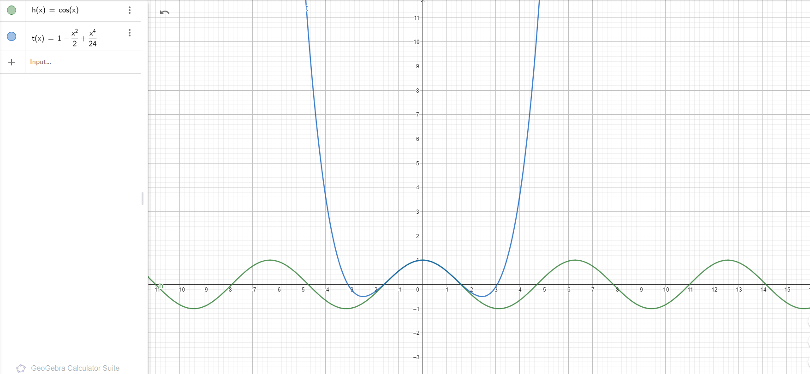
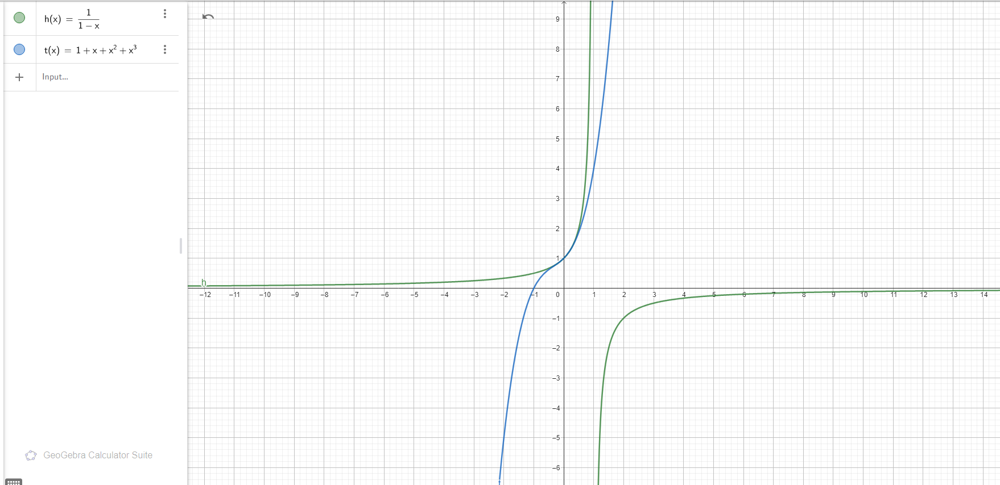
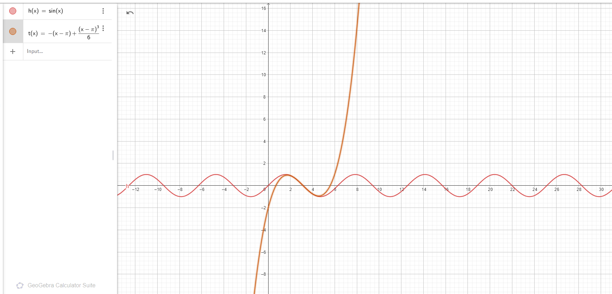
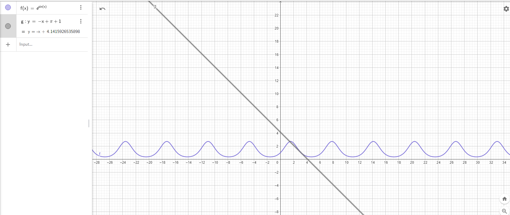
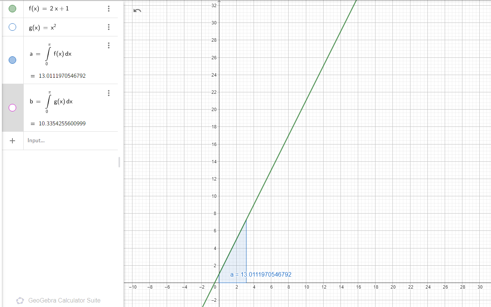
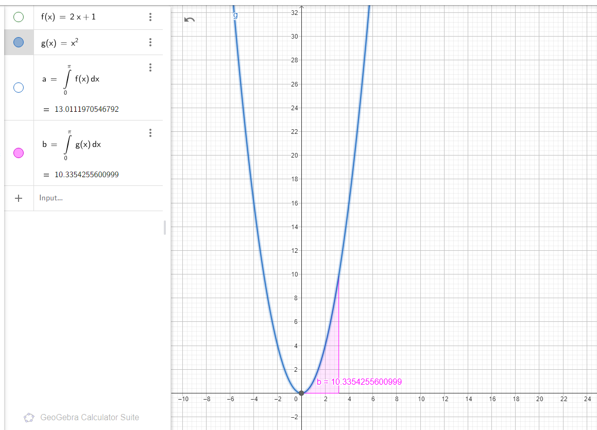

# 23. Taylor Series
### What is a Taylor Series?

The **Taylor series** is a mathematical tool used to approximate complex functions using polynomials. It represents a function as an infinite sum of terms, where each term is calculated from the function's derivatives at a single point. The Taylor series is particularly useful because it allows us to approximate functions that are difficult to compute directly, using simpler polynomial expressions.

---

### General Formula of the Taylor Series

The Taylor series of a function $ f(x) $ around a point $ x = a $ is given by:

$$
f(x) = f(a) + f'(a)(x - a) + \frac{f''(a)}{2!}(x - a)^2 + \frac{f'''(a)}{3!}(x - a)^3 + \dots
$$

Here:
- $ f(a) $: The value of the function at the point $ x = a $.
- $ f'(a) $: The first derivative of the function at $ x = a $.
- $ f''(a) $: The second derivative of the function at $ x = a $.
- $ n! $: The factorial of $ n $, which is the product of all positive integers up to $ n $.
- $ (x - a)^n $: The distance from the point $ x $ to the point $ a $, raised to the power of $n$.

---

### Key Points About the Taylor Series

1. **Local Approximation**:
   - The Taylor series provides a **local approximation** of a function. This means it works well near the point $ x = a $, but the approximation may become less accurate as $ x $ moves further away from $ a $.

2. **Infinite Series**:
   - The Taylor series is an **infinite series**. In practice, we often use a finite number of terms (called a **Taylor polynomial**) to approximate the function. The more terms we include, the better the approximation.

3. **Special Case: Maclaurin Series**:
   - When $ a = 0 $, the Taylor series is called a **Maclaurin series**. For example:
     $$
     e^x = 1 + x + \frac{x^2}{2!} + \frac{x^3}{3!} + \dots
     $$

4. **Applications**:
   - Taylor series are widely used in physics, engineering, and computer science to approximate functions, solve differential equations, and analyze the behavior of systems.

   ### Why is the Taylor Series Important?

1. **Simplifies Complex Functions**:
   - Taylor series break down complex functions into simpler polynomial forms, making calculations easier.

2. **Numerical Approximations**:
   - In computer science and engineering, Taylor series are used to approximate functions numerically when exact solutions are difficult to compute.

3. **Understanding Function Behavior**:
   - By analyzing the Taylor series, we can understand how a function behaves near a specific point.

---

### Limitations of the Taylor Series

1. **Local Approximation**:
   - The Taylor series is only accurate near the point $ x = a $. As $ x $ moves away from $ a $, the approximation may become inaccurate.

2. **Convergence Issues**:
   - Not all functions have a Taylor series that converges everywhere. For example, the Taylor series for $$ \frac{1}{1 - x} $$ only converges for $$ |x| < 1 $$.

## a) Taylor series for $$ f(x) = \cos(x) $$ around $$ x = 0 $$ up to the 4th degree:

1. **Find the derivatives of the function:**
   - $$ f(x) = \cos(x) $$
   - $$ f'(x) = -\sin(x) $$
   - $$ f''(x) = -\cos(x) $$
   - $$ f'''(x) = \sin(x) $$
   - $$ f''''(x) = \cos(x) $$

2. **Evaluate the derivatives at $$ x = 0 $$:**
   - $$ f(0) = \cos(0) = 1 $$
   - $$ f'(0) = -\sin(0) = 0 $$
   - $$ f''(0) = -\cos(0) = -1 $$
   - $$ f'''(0) = \sin(0) = 0 $$
   - $$ f''''(0) = \cos(0) = 1 $$

3. **Write the Taylor series:**
   - Using the Taylor series formula:
     $$ 
     f(x) = f(0) + f'(0)x + \frac{f''(0)}{2!}x^2 + \frac{f'''(0)}{3!}x^3 + \frac{f''''(0)}{4!}x^4
     $$
   - Substitute the values:
     $$ 
     f(x) = 1 + 0 \cdot x + \frac{-1}{2}x^2 + \frac{0}{6}x^3 + \frac{1}{24}x^4
     $$
   - Simplify:
     $$ 
     f(x) = 1 - \frac{x^2}{2} + \frac{x^4}{24}
     $$

4. **Visualization in GeoGebra:**
   - Plot $$ f(x) = \cos(x) $$ and $$ f(x) = 1 - \frac{x^2}{2} + \frac{x^4}{24} $$ in GeoGebra to compare.

---

## b) Taylor series for $$ h(x) = \frac{1}{1 - x} $$ around $$ x = 0 $$ up to the 3rd degree:

1. **Find the derivatives of the function:**
   - $$ h(x) = \frac{1}{1 - x} = (1 - x)^{-1} $$
   - $$ h'(x) = (1 - x)^{-2} $$
   - $$ h''(x) = 2(1 - x)^{-3} $$
   - $$ h'''(x) = 6(1 - x)^{-4} $$

2. **Evaluate the derivatives at $$ x = 0 $$:**
   - $$ h(0) = 1 $$
   - $$ h'(0) = 1 $$
   - $$ h''(0) = 2 $$
   - $$ h'''(0) = 6 $$

3. **Write the Taylor series:**
   - Using the Taylor series formula:
     $$ 
     h(x) = h(0) + h'(0)x + \frac{h''(0)}{2!}x^2 + \frac{h'''(0)}{3!}x^3
     $$
   - Substitute the values:
     $$ 
     h(x) = 1 + 1 \cdot x + \frac{2}{2}x^2 + \frac{6}{6}x^3
     $$
   - Simplify:
     $$ 
     h(x) = 1 + x + x^2 + x^3
     $$

4. **Visualization in GeoGebra:**
   - Plot $$ h(x) = \frac{1}{1 - x} $$ and $$ h(x) = 1 + x + x^2 + x^3 $$ in GeoGebra to compare.

   

---

## c) Taylor series for $$ g(x) = \sin(x) $$ around $$ x = \pi $$ up to the 3rd degree:

1. **Find the derivatives of the function:**
   - $$ g(x) = \sin(x) $$
   - $$ g'(x) = \cos(x) $$
   - $$ g''(x) = -\sin(x) $$
   - $$ g'''(x) = -\cos(x) $$

2. **Evaluate the derivatives at $$ x = \pi $$:**
   - $$ g(\pi) = \sin(\pi) = 0 $$
   - $$ g'(\pi) = \cos(\pi) = -1 $$
   - $$ g''(\pi) = -\sin(\pi) = 0 $$
   - $$ g'''(\pi) = -\cos(\pi) = 1 $$

3. **Write the Taylor series:**
   - Using the Taylor series formula:
     $$ 
     g(x) = g(\pi) + g'(\pi)(x - \pi) + \frac{g''(\pi)}{2!}(x - \pi)^2 + \frac{g'''(\pi)}{3!}(x - \pi)^3
     $$
   - Substitute the values:
     $$ 
     g(x) = 0 + (-1)(x - \pi) + \frac{0}{2}(x - \pi)^2 + \frac{1}{6}(x - \pi)^3
     $$
   - Simplify:
     $$ 
     g(x) = -(x - \pi) + \frac{(x - \pi)^3}{6}
     $$

4. **Visualization in GeoGebra:**
   - Plot $$ g(x) = \sin(x) $$ and $$ g(x) = -(x - \pi) + \frac{(x - \pi)^3}{6} $$ in GeoGebra to compare.

---

## 2. Finding the Tangent Line

### Tangent line to $$ f(x) = e^{\sin(x)} $$ at $$ x_0 = \pi $$:

1. **Find the value of the function at $$ x_0 = \pi $$:**
   - $$ f(\pi) = e^{\sin(\pi)} = e^0 = 1 $$

2. **Find the derivative of the function:**
   - $$ f'(x) = e^{\sin(x)} \cdot \cos(x) $$

3. **Evaluate the derivative at $$ x_0 = \pi $$:**
   - $$ f'(\pi) = e^{\sin(\pi)} \cdot \cos(\pi) = e^0 \cdot (-1) = -1 $$

4. **Write the equation of the tangent line:**
   - The tangent line formula:
     $$ 
     y = f'(x_0)(x - x_0) + f(x_0)
     $$
   - Substitute the values:
     $$ 
     y = -1 \cdot (x - \pi) + 1
     $$
   - Simplify:
     $$ 
     y = -x + \pi + 1
     $$

5. **Visualization in GeoGebra:**
   - Plot $$ f(x) = e^{\sin(x)} $$ and the tangent line $$ y = -x + \pi + 1 $$ in GeoGebra to verify.

   

### What is an Integral?

The **integral** is a fundamental concept in calculus used to calculate the area under a curve or to find the antiderivative of a function. There are two main types of integrals:

1. **Indefinite Integral**:
   - The indefinite integral represents the antiderivative of a function. It is a family of functions that differ by a constant.
   - The result of an indefinite integral includes a constant of integration, denoted as $ C $.
   - Mathematically, it is written as:
     $$
     \int f(x) \, dx = F(x) + C
     $$
     where $ F(x) $ is the antiderivative of $ f(x) $, and $ C $ is the constant of integration.

2. **Definite Integral**:
   - The definite integral calculates the area under the curve of a function between two specified limits (bounds).
   - It is represented as:
     $$
     \int_a^b f(x) \, dx
     $$
     where $ a $ and $ b $ are the lower and upper limits of integration, respectively.
   - The result of a definite integral is a numerical value representing the net area under the curve.

---

### Key Concepts in Integration:

1. **Antiderivative**:
   - The antiderivative of a function $ f(x) $ is a function $ F(x) $ such that:
     $$
     F'(x) = f(x)
     $$
   - For example, the antiderivative of $ f(x) = 2x $ is $ F(x) = x^2 + C $, since:
     $$
     \frac{d}{dx}(x^2 + C) = 2x
     $$

2. **Area Under a Curve**:
   - The definite integral $ \int_a^b f(x) \, dx $ calculates the area between the curve $ f(x) $, the $ x $-axis, and the vertical lines $ x = a $ and $ x = b $.
   - If the curve lies below the $ x $-axis, the integral gives a negative value, representing the "signed area."

3. **Fundamental Theorem of Calculus**:
   - This theorem connects differentiation and integration. It states that if $ F(x) $ is the antiderivative of $ f(x) $, then:
     $$
     \int_a^b f(x) \, dx = F(b) - F(a)
     $$
   - This allows us to evaluate definite integrals using antiderivatives.

4. **Applications of Integrals**:
   - Integrals are used in various fields, including physics (e.g., calculating work, energy, and motion), engineering (e.g., analyzing systems and signals), and economics (e.g., finding total revenue or cost).

---

### Example: Indefinite Integral of $ f(x) = x^2 $

- **Step 1**: Identify the function to integrate:
  $$
  \int x^2 \, dx
  $$
- **Step 2**: Apply the power rule for integration:
  $$
  \int x^n \, dx = \frac{x^{n+1}}{n+1} + C \quad \text{(for } n \neq -1 \text{)}
  $$
  Here, $ n = 2 $, so:
  $$
  \int x^2 \, dx = \frac{x^{2+1}}{2+1} + C = \frac{x^3}{3} + C
  $$
- **Step 3**: Write the final result:
  $$
  \int x^2 \, dx = \frac{x^3}{3} + C
  $$

---

### Example: Definite Integral of $ f(x) = 2x $ from $ x = 1 $ to $ x = 3 $

- **Step 1**: Identify the function and limits:
  $$
  \int_1^3 2x \, dx
  $$
- **Step 2**: Find the antiderivative of $ 2x $:
  $$
  \int 2x \, dx = x^2 + C
  $$
- **Step 3**: Apply the Fundamental Theorem of Calculus:
  $$
  \int_1^3 2x \, dx = \left[ x^2 \right]_1^3 = (3^2) - (1^2) = 9 - 1 = 8
  $$
- **Step 4**: Interpret the result:
  The area under the curve $ f(x) = 2x $ from $ x = 1 $ to $ x = 3 $ is $ 8 $.

---
# 24. Integrals

## 1. Compute the Following Integrals:

#### a) $ \int 1 \, dx $
- **Step 1**: The integral of a constant function is the variable itself.
  $$
  \int 1 \, dx = x
  $$
- **Step 2**: Add the constant of integration $ C $.
- **Solution**:
  $$
  \int 1 \, dx = x + C
  $$

---

#### b) $ \int (x^2 + 2) \, dx $
- **Step 1**: Split the integral:
  $$
  \int (x^2 + 2) \, dx = \int x^2 \, dx + \int 2 \, dx
  $$
- **Step 2**: Compute $ \int x^2 \, dx $:
  $$
  \int x^2 \, dx = \frac{x^3}{3}
  $$
- **Step 3**: Compute $ \int 2 \, dx $:
  $$
  \int 2 \, dx = 2x
  $$
- **Step 4**: Combine the results and add $ C $.
- **Solution**:
  $$
  \int (x^2 + 2) \, dx = \frac{x^3}{3} + 2x + C
  $$

---

#### c) $ \int 2 \sin(x) \, dx $
- **Step 1**: Factor out the constant:
  $$
  \int 2 \sin(x) \, dx = 2 \int \sin(x) \, dx
  $$
- **Step 2**: Compute $ \int \sin(x) \, dx $:
  $$
  \int \sin(x) \, dx = -\cos(x)
  $$
- **Step 3**: Multiply by the constant:
  $$
  2 \int \sin(x) \, dx = -2 \cos(x)
  $$
- **Step 4**: Add $ C $.
- **Solution**:
  $$
  \int 2 \sin(x) \, dx = -2 \cos(x) + C
  $$

---

#### d) $ \int \frac{3}{x} \, dx $
- **Step 1**: Factor out the constant:
  $$
  \int \frac{3}{x} \, dx = 3 \int \frac{1}{x} \, dx
  $$
- **Step 2**: Compute $ \int \frac{1}{x} \, dx $:
  $$
  \int \frac{1}{x} \, dx = \ln|x|
  $$
- **Step 3**: Multiply by the constant:
  $$
  3 \int \frac{1}{x} \, dx = 3 \ln|x|
  $$
- **Step 4**: Add $ C $.
- **Solution**:
  $$
  \int \frac{3}{x} \, dx = 3 \ln|x| + C
  $$

---

#### e) $ \int \frac{1}{3} \, dx $
- **Step 1**: The integral of a constant is the constant times the variable:
  $$
  \int \frac{1}{3} \, dx = \frac{1}{3} \int 1 \, dx
  $$
- **Step 2**: Compute $ \int 1 \, dx $:
  $$
  \int 1 \, dx = x
  $$
- **Step 3**: Multiply by the constant:
  $$
  \frac{1}{3} \int 1 \, dx = \frac{1}{3}x
  $$
- **Step 4**: Add $ C $.
- **Solution**:
  $$
  \int \frac{1}{3} \, dx = \frac{1}{3}x + C
  $$

---

#### f) $ \int \left( \frac{1}{3}x^4 - 5 \right) \, dx $
- **Step 1**: Split the integral:
  $$
  \int \left( \frac{1}{3}x^4 - 5 \right) \, dx = \int \frac{1}{3}x^4 \, dx - \int 5 \, dx
  $$
- **Step 2**: Compute $ \int \frac{1}{3}x^4 \, dx $:
  $$
  \int \frac{1}{3}x^4 \, dx = \frac{1}{3} \cdot \frac{x^5}{5} = \frac{x^5}{15}
  $$
- **Step 3**: Compute $ \int 5 \, dx $:
  $$
  \int 5 \, dx = 5x
  $$
- **Step 4**: Combine the results and add $ C $.
- **Solution**:
  $$
  \int \left( \frac{1}{3}x^4 - 5 \right) \, dx = \frac{x^5}{15} - 5x + C
  $$

---

#### g) $ \int (\sin^2 x + \cos^2 x) \, dx $
- **Step 1**: Use the Pythagorean identity:
  $$
  \sin^2 x + \cos^2 x = 1
  $$
- **Step 2**: Rewrite the integral:
  $$
  \int (\sin^2 x + \cos^2 x) \, dx = \int 1 \, dx
  $$
- **Step 3**: Compute $ \int 1 \, dx $:
  $$
  \int 1 \, dx = x
  $$
- **Step 4**: Add $ C $.
- **Solution**:
  $$
  \int (\sin^2 x + \cos^2 x) \, dx = x + C
  $$

---

#### h) $ \int (5 \sin x + 3e^x) \, dx $
- **Step 1**: Split the integral:
  $$
  \int (5 \sin x + 3e^x) \, dx = 5 \int \sin x \, dx + 3 \int e^x \, dx
  $$
- **Step 2**: Compute $ \int \sin x \, dx $:
  $$
  \int \sin x \, dx = -\cos x
  $$
- **Step 3**: Compute $ \int e^x \, dx $:
  $$
  \int e^x \, dx = e^x
  $$
- **Step 4**: Multiply by the constants:
  $$
  5 \int \sin x \, dx = -5 \cos x
  $$
  $$
  3 \int e^x \, dx = 3e^x
  $$
- **Step 5**: Combine the results and add $ C $.
- **Solution**:
  $$
  \int (5 \sin x + 3e^x) \, dx = -5 \cos x + 3e^x + C
  $$

---

#### i) $ \int \sqrt[3]{x} \, dx $
- **Step 1**: Rewrite $ \sqrt[3]{x} $ as $ x^{1/3} $:
  $$
  \int \sqrt[3]{x} \, dx = \int x^{1/3} \, dx
  $$
- **Step 2**: Apply the power rule:
  $$
  \int x^{1/3} \, dx = \frac{x^{4/3}}{4/3} = \frac{3}{4} x^{4/3}
  $$
- **Step 3**: Add $ C $.
- **Solution**:
  $$
  \int \sqrt[3]{x} \, dx = \frac{3}{4} x^{4/3} + C
  $$

---

#### j) $ \int \sqrt{10x} \, dx $
- **Step 1**: Rewrite $ \sqrt{10x} $ as $ \sqrt{10} \cdot x^{1/2} $:
  $$
  \int \sqrt{10x} \, dx = \sqrt{10} \int x^{1/2} \, dx
  $$
- **Step 2**: Apply the power rule:
  $$
  \int x^{1/2} \, dx = \frac{x^{3/2}}{3/2} = \frac{2}{3} x^{3/2}
  $$
- **Step 3**: Multiply by $ \sqrt{10} $:
  $$
  \sqrt{10} \cdot \frac{2}{3} x^{3/2} = \frac{2\sqrt{10}}{3} x^{3/2}
  $$
- **Step 4**: Add $ C $.
- **Solution**:
  $$
  \int \sqrt{10x} \, dx = \frac{2\sqrt{10}}{3} x^{3/2} + C
  $$

---

#### k) $ \int \cos \left( \frac{5}{3}x + 3 \right) \, dx $
- **Step 1**: Let $ u = \frac{5}{3}x + 3 $. Then:
  $$
  du = \frac{5}{3} dx \quad \Rightarrow \quad dx = \frac{3}{5} du
  $$
- **Step 2**: Rewrite the integral in terms of $ u $:
  $$
  \int \cos(u) \cdot \frac{3}{5} du = \frac{3}{5} \int \cos(u) \, du
  $$
- **Step 3**: Compute $ \int \cos(u) \, du $:
  $$
  \int \cos(u) \, du = \sin(u)
  $$
- **Step 4**: Multiply by $ \frac{3}{5} $:
  $$
  \frac{3}{5} \int \cos(u) \, du = \frac{3}{5} \sin(u)
  $$
- **Step 5**: Substitute back $ u = \frac{5}{3}x + 3 $:
  $$
  \frac{3}{5} \sin(u) = \frac{3}{5} \sin\left( \frac{5}{3}x + 3 \right)
  $$
- **Step 6**: Add $ C $.
- **Solution**:
  $$
  \int \cos \left( \frac{5}{3}x + 3 \right) \, dx = \frac{3}{5} \sin\left( \frac{5}{3}x + 3 \right) + C
  $$

---

#### l) $ \int \frac{\cos(\ln(x))}{x} \, dx $
- **Step 1**: Let $ u = \ln(x) $. Then:
  $$
  du = \frac{1}{x} dx \quad \Rightarrow \quad dx = x \, du
  $$
- **Step 2**: Rewrite the integral in terms of $ u $:
  $$
  \int \frac{\cos(u)}{x} \cdot x \, du = \int \cos(u) \, du
  $$
- **Step 3**: Compute $ \int \cos(u) \, du $:
  $$
  \int \cos(u) \, du = \sin(u)
  $$
- **Step 4**: Substitute back $ u = \ln(x) $:
  $$
  \sin(u) = \sin(\ln(x))
  $$
- **Step 5**: Add $ C $.
- **Solution**:
  $$
  \int \frac{\cos(\ln(x))}{x} \, dx = \sin(\ln(x)) + C
  $$

---

#### m) $ \int x \ln(x) \, dx $
- **Step 1**: Use integration by parts:
  - Let $ u = \ln(x) $ and $ dv = x \, dx $.
  - Then $ du = \frac{1}{x} dx $ and $ v = \frac{x^2}{2} $.
- **Step 2**: Apply the integration by parts formula:
  $$
  \int u \, dv = uv - \int v \, du
  $$
  $$
  \int x \ln(x) \, dx = \ln(x) \cdot \frac{x^2}{2} - \int \frac{x^2}{2} \cdot \frac{1}{x} \, dx
  $$
- **Step 3**: Simplify the second integral:
  $$
  \int \frac{x^2}{2} \cdot \frac{1}{x} \, dx = \int \frac{x}{2} \, dx = \frac{x^2}{4}
  $$
- **Step 4**: Combine the results:
  $$
  \int x \ln(x) \, dx = \frac{x^2}{2} \ln(x) - \frac{x^2}{4}
  $$
- **Step 5**: Add $ C $.
- **Solution**:
  $$
  \int x \ln(x) \, dx = \frac{x^2}{2} \ln(x) - \frac{x^2}{4} + C
  $$

---

#### n) $ \int x e^x \, dx $
- **Step 1**: Use integration by parts:
  - Let $ u = x $ and $ dv = e^x \, dx $.
  - Then $ du = dx $ and $ v = e^x $.
- **Step 2**: Apply the integration by parts formula:
  $$
  \int u \, dv = uv - \int v \, du
  $$
  $$
  \int x e^x \, dx = x e^x - \int e^x \, dx
  $$
- **Step 3**: Compute $ \int e^x \, dx $:
  $$
  \int e^x \, dx = e^x
  $$
- **Step 4**: Combine the results:
  $$
  \int x e^x \, dx = x e^x - e^x
  $$
- **Step 5**: Factor out $ e^x $ and add $ C $.
- **Solution**:
  $$
  \int x e^x \, dx = e^x (x - 1) + C
  $$

---

### 2. Calculate Integrals Over the Interval $[0, \pi]$ and Visualize in GeoGebra:

#### a) $ \int_0^\pi (2x + 1) \, dx $
- **Step 1**: Find the antiderivative of $ 2x + 1 $:
  $$
  \int (2x + 1) \, dx = x^2 + x + C
  $$
- **Step 2**: Apply the limits of integration:
  $$
  \left[ x^2 + x \right]_0^\pi = (\pi^2 + \pi) - (0 + 0) = \pi^2 + \pi
  $$
- **Solution**:
  $$
  \int_0^\pi (2x + 1) \, dx = \pi^2 + \pi
  $$
  

#### b) $ \int_0^\pi x^2 \, dx $
- **Step 1**: Find the antiderivative of $ x^2 $:
  $$
  \int x^2 \, dx = \frac{x^3}{3} + C
  $$
- **Step 2**: Apply the limits of integration:
  $$
  \left[ \frac{x^3}{3} \right]_0^\pi = \frac{\pi^3}{3} - 0 = \frac{\pi^3}{3}
  $$
- **Solution**:
  $$
  \int_0^\pi x^2 \, dx = \frac{\pi^3}{3}
  $$

---

### 3. Calculate the Area of the Region Bounded by $ x = 1, \, x = 2, \, y = 0 $, and $ y = x^2 + 1 $:

- **Step 1**: Identify the bounds and the function:
  - The region is bounded by $ x = 1 $, $ x = 2 $, $ y = 0 $, and $ y = x^2 + 1 $.
- **Step 2**: Set up the integral for the area:
  $$
  \text{Area} = \int_1^2 (x^2 + 1) \, dx
  $$
- **Step 3**: Find the antiderivative of $ x^2 + 1 $:
  $$
  \int (x^2 + 1) \, dx = \frac{x^3}{3} + x + C
  $$
- **Step 4**: Apply the limits of integration:
  $$
  \left[ \frac{x^3}{3} + x \right]_1^2 = \left( \frac{8}{3} + 2 \right) - \left( \frac{1}{3} + 1 \right) = \frac{10}{3}
  $$
- **Solution**:
  $$
  \text{Area} = \frac{10}{3}
  $$

- **Visualization in GeoGebra**:
  - Plot the region bounded by $ x = 1 $, $ x = 2 $, $ y = 0 $, and $ y = x^2 + 1 $.
  - Shade the area to visualize the region.

---

### 4. Calculate the Area Under the Sine Curve Over $[0, \pi]$:

- **Step 1**: Identify the function and interval:
  - The function is $ f(x) = \sin(x) $, and the interval is $[0, \pi]$.
- **Step 2**: Set up the integral for the area:
  $$
  \text{Area} = \int_0^\pi \sin(x) \, dx
  $$
- **Step 3**: Find the antiderivative of $ \sin(x) $:
  $$
  \int \sin(x) \, dx = -\cos(x) + C
  $$
- **Step 4**: Apply the limits of integration:
  $$
  \left[ -\cos(x) \right]_0^\pi = -\cos(\pi) + \cos(0) = -(-1) + 1 = 2
  $$
- **Solution**:
  $$
  \text{Area} = 2
  $$

- **Visualization in GeoGebra**:
  - Plot the function $ f(x) = \sin(x) $ over the interval $[0, \pi]$.
  - Shade the area under the curve to visualize the integral.

---

