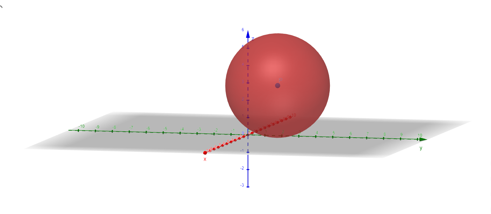
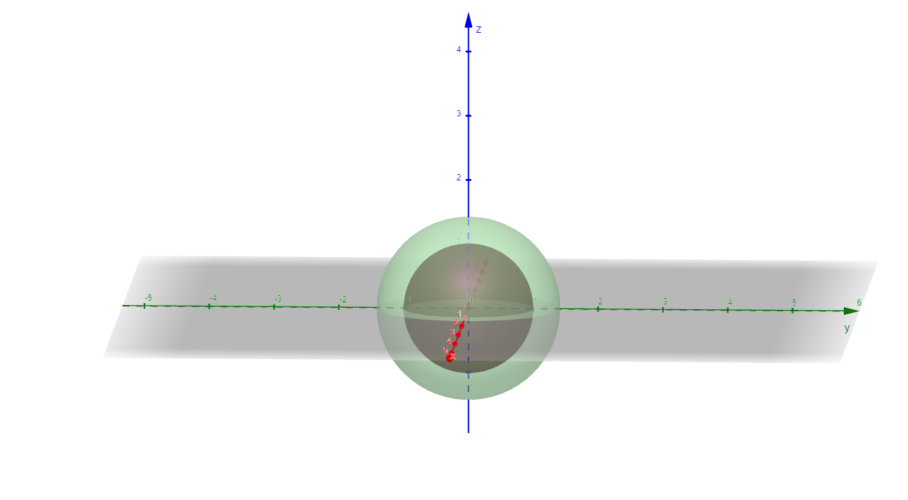
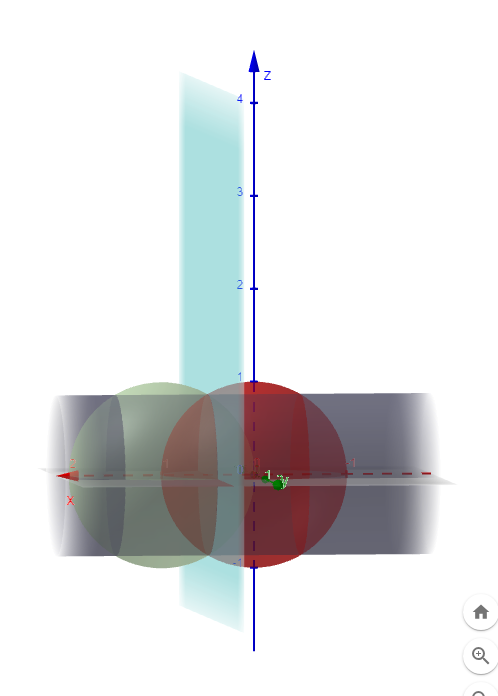
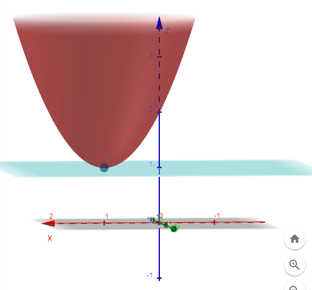

# Vectors I Solutions

## 1. By what number should vector **v = [3, 4]** be multiplied so that its length is equal to 1?
To make the length of the vector equal to 1, we divide it by its magnitude. The magnitude of the vector **v = [3, 4]** is calculated as:
$$
\|v\| = \sqrt{3^2 + 4^2} = \sqrt{9 + 16} = 5
$$
The vector must be multiplied by:
$$
\frac{1}{\|v\|} = \frac{1}{5}
$$
Thus, the unit vector is:
$$
v_{\text{unit}} = \frac{1}{5} \cdot [3, 4] = [0.6, 0.8]
$$

---

## 2. Calculate the length of vector **v = [1, 2, 3]** and find the unit vector of this vector.
The length (magnitude) of the vector is:
$$
\|v\| = \sqrt{1^2 + 2^2 + 3^2} = \sqrt{1 + 4 + 9} = \sqrt{14}
$$
The unit vector is found by dividing each component by the magnitude:
$$
v_{\text{unit}} = \frac{1}{\sqrt{14}} \cdot [1, 2, 3] = \left[\frac{1}{\sqrt{14}}, \frac{2}{\sqrt{14}}, \frac{3}{\sqrt{14}}\right]
$$

---

## 3. Plot the vector and the unit vector from the previous exercise.
Here, the original vector **v = [1, 2, 3]** and its unit vector **v_unit** can be visualized in 3D space. (Graphical solution needed for plotting).

---

## 4. Calculate the length of vector **v = [1, 2, -1]** and find the unit vector of this vector.
The length (magnitude) of the vector is:
$$
\|v\| = \sqrt{1^2 + 2^2 + (-1)^2} = \sqrt{1 + 4 + 1} = \sqrt{6}
$$
The unit vector is:
$$
v_{\text{unit}} = \frac{1}{\sqrt{6}} \cdot [1, 2, -1] = \left[\frac{1}{\sqrt{6}}, \frac{2}{\sqrt{6}}, \frac{-1}{\sqrt{6}}\right]
$$

---

## 5. Find the Cartesian coordinates of vector **v = [2, 3, 4]** in the basis **b₁ = [1, 0, 1]**, **b₂ = [0, 1, 0]**, **b₃ = [0, 0, -1]**.
We express **v** as a linear combination of the basis vectors:
$$
v = c_1 \cdot b_1 + c_2 \cdot b_2 + c_3 \cdot b_3
$$
This leads to the system of equations:
$$
2 = c_1 \cdot 1 + c_2 \cdot 0 + c_3 \cdot 0 \\
3 = c_1 \cdot 0 + c_2 \cdot 1 + c_3 \cdot 0 \\
4 = c_1 \cdot 1 + c_2 \cdot 0 - c_3 \cdot 1
$$
Solving these equations:
1. From the first equation: \( c_1 = 2 \),
2. From the second equation: \( c_2 = 3 \),
3. From the third equation: \( 4 = 2 - c_3 \implies c_3 = -2 \).

Thus, the coordinates of **v** in the new basis are:
$$
[2, 3, -2]
$$
# Vectors II Solutions

## 1. Perform the addition of vector **[2, 0]** to vector **[-1, 1]**. Plot both vectors and their sum on a graph.
The sum of the vectors is calculated as:
$$
[2, 0] + [-1, 1] = [2 + (-1), 0 + 1] = [1, 1]
$$
To visualize:
- Vector **[2, 0]** starts at the origin and ends at (2, 0).
- Vector **[-1, 1]** starts at the origin and ends at (-1, 1).
- The resultant vector **[1, 1]** also starts at the origin and ends at (1, 1).
(Plotting needed for graphical representation.)

---

## 2. Calculate the area of the triangle spanned by vectors **[2, 1]** and **[-1, 1]**.
The area of a triangle formed by two vectors is:
$$
\text{Area} = \frac{1}{2} \cdot \|\vec{u} \times \vec{v}\|
$$
The cross product magnitude in 2D is:
$$
\|\vec{u} \times \vec{v}\| = |2 \cdot 1 - (-1) \cdot 1| = |2 + 1| = 3
$$
Thus, the area is:
$$
\text{Area} = \frac{1}{2} \cdot 3 = 1.5
$$

---

## 3. Calculate the volume of the parallelepiped spanned by vectors **[2, 1, -1]**, **[-1, 1, 1]**, and **[1, 2, 3]**.
The volume of a parallelepiped is given by the scalar triple product:
$$
\text{Volume} = |\vec{u} \cdot (\vec{v} \times \vec{w})|
$$
1. Compute the cross product:
$$
\vec{v} \times \vec{w} = 
\begin{vmatrix}
\mathbf{i} & \mathbf{j} & \mathbf{k} \\
-1 & 1 & 1 \\
1 & 2 & 3
\end{vmatrix}
= \mathbf{i}(1 \cdot 3 - 1 \cdot 2) - \mathbf{j}(-1 \cdot 3 - 1 \cdot 1) + \mathbf{k}(-1 \cdot 2 - 1 \cdot 1)
$$
$$
= \mathbf{i}(3 - 2) - \mathbf{j}(-3 - 1) + \mathbf{k}(-2 - 1)
= \mathbf{i}(1) - \mathbf{j}(-4) + \mathbf{k}(-3)
= [1, 4, -3]
$$
2. Compute the dot product with **[2, 1, -1]**:
$$
\vec{u} \cdot [1, 4, -3] = 2 \cdot 1 + 1 \cdot 4 + (-1) \cdot (-3) = 2 + 4 + 3 = 9
$$
Thus, the volume is:
$$
\text{Volume} = |9| = 9
$$

---

## 4. Check if vectors **[2, 1]** and **[-1, 1]** are perpendicular.
Two vectors are perpendicular if their dot product is zero:
$$
\vec{u} \cdot \vec{v} = 2 \cdot (-1) + 1 \cdot 1 = -2 + 1 = -1
$$
Since the dot product is not zero, the vectors are **not perpendicular**.

---

## 5. Calculate the angle in degrees between vectors **[1, 2, 1]** and **[1, 3, -2]**.
The angle between two vectors is given by:
$$
\cos\theta = \frac{\vec{u} \cdot \vec{v}}{\|\vec{u}\| \cdot \|\vec{v}\|}
$$
1. Compute the dot product:
$$
\vec{u} \cdot \vec{v} = 1 \cdot 1 + 2 \cdot 3 + 1 \cdot (-2) = 1 + 6 - 2 = 5
$$
2. Compute the magnitudes:
$$
\|\vec{u}\| = \sqrt{1^2 + 2^2 + 1^2} = \sqrt{1 + 4 + 1} = \sqrt{6}
$$
$$
\|\vec{v}\| = \sqrt{1^2 + 3^2 + (-2)^2} = \sqrt{1 + 9 + 4} = \sqrt{14}
$$
3. Compute the cosine:
$$
\cos\theta = \frac{5}{\sqrt{6} \cdot \sqrt{14}} = \frac{5}{\sqrt{84}}
$$
4. Find the angle in degrees:
$$
\theta = \cos^{-1}\left(\frac{5}{\sqrt{84}}\right)
$$
(Use a calculator for the final numerical result.)

---

## 6. Prove that for three-dimensional vectors, the following identity is satisfied:
**x × (y × z) = (x · z)y - (x · y)z**
Let **x = [x₁, x₂, x₃]**, **y = [y₁, y₂, y₃]**, and **z = [z₁, z₂, z₃]**.
1. Use the vector triple product expansion formula:
$$
x \times (y \times z) = (x \cdot z)y - (x \cdot y)z
$$
2. This identity holds universally for all three-dimensional vectors. Verify it by expanding both sides using the properties of dot and cross products.
## Vectors III Solutions

### 1. Divide the line segment connecting points A(-1, 2) and B(3, -2) in the ratio 1:3

To find the point \( P(x, y) \) that divides the line segment joining points \( A(-1, 2) \) and \( B(3, -2) \) in the ratio 1:3, we use the section formula.

The section formula states that if a point \( P(x, y) \) divides the line segment joining points \( A(x_1, y_1) \) and \( B(x_2, y_2) \) in the ratio \( m:n \), the coordinates of \( P \) are given by:

$$
x = \frac{m x_2 + n x_1}{m + n}
$$
$$
y = \frac{m y_2 + n y_1}{m + n}
$$

In this case, \( A(-1, 2) \), \( B(3, -2) \), and the ratio is \( 1:3 \). Thus, we have \( m = 1 \) and \( n = 3 \).

For the x-coordinate:
$$
x = \frac{1(3) + 3(-1)}{1 + 3} = \frac{3 - 3}{4} = 0
$$

For the y-coordinate:
$$
y = \frac{1(-2) + 3(2)}{1 + 3} = \frac{-2 + 6}{4} = 1
$$

So, the point dividing the line segment in the ratio 1:3 is \( P(0, 1) \).

### 2. Project vector \( a = (3, 4) \) onto the OX and OY axes

To project vector \( a = (3, 4) \) onto the OX axis (the x-axis), we keep only the x-component, which is 3. So, the projection of \( a \) onto the OX axis is:

$$
a_{OX} = (3, 0)
$$

To project vector \( a = (3, 4) \) onto the OY axis (the y-axis), we keep only the y-component, which is 4. So, the projection of \( a \) onto the OY axis is:

$$
a_{OY} = (0, 4)
$$

### 3. Project vector \( a = (2, 3) \) onto vector \( b = (1, 1) \)

The formula to project vector \( a \) onto vector \( b \) is:

$$
\text{proj}_{b}(a) = \frac{a \cdot b}{b \cdot b} \cdot b
$$

First, calculate the dot products:

$$
a \cdot b = 2(1) + 3(1) = 2 + 3 = 5
$$
$$
b \cdot b = 1(1) + 1(1) = 1 + 1 = 2
$$

Now, using the projection formula:

$$
\text{proj}_{b}(a) = \frac{5}{2} \cdot (1, 1) = \left( \frac{5}{2}, \frac{5}{2} \right)
$$

So, the projection of vector \( a = (2, 3) \) onto vector \( b = (1, 1) \) is \( \left( \frac{5}{2}, \frac{5}{2} \right) \).

### 4. Project vector \( b = (1, 1) \) onto vector \( a = (2, 3) \)

To project vector \( b = (1, 1) \) onto vector \( a = (2, 3) \), we use the same projection formula:

$$
\text{proj}_{a}(b) = \frac{b \cdot a}{a \cdot a} \cdot a
$$

First, calculate the dot products:

$$
b \cdot a = 1(2) + 1(3) = 2 + 3 = 5
$$
$$
a \cdot a = 2(2) + 3(3) = 4 + 9 = 13
$$

Now, using the projection formula:

$$
\text{proj}_{a}(b) = \frac{5}{13} \cdot (2, 3) = \left( \frac{10}{13}, \frac{15}{13} \right)
$$

So, the projection of vector \( b = (1, 1) \) onto vector \( a = (2, 3) \) is \( \left( \frac{10}{13}, \frac{15}{13} \right) \).

---

# Equations of Lines on a Plane Solutions

## 1. The line passes through points **A(1, 2)** and **B(3, 4)**. Find the equation of the line.
The slope \(m\) of the line is:
$$
m = \frac{y_2 - y_1}{x_2 - x_1} = \frac{4 - 2}{3 - 1} = \frac{2}{2} = 1
$$
The equation of the line in slope-intercept form is:
$$
y - y_1 = m(x - x_1)
$$
Substitute \(m = 1\), \(x_1 = 1\), \(y_1 = 2\):
$$
y - 2 = 1(x - 1) \implies y = x + 1
$$
Thus, the equation of the line is:
$$
y = x + 1
$$

---

## 2. The line passes through point **A(1, 2)** and is parallel to the line \(y = 2x + 3\). Find the equation of the line.
A parallel line has the same slope \(m = 2\). Using the point-slope form:
$$
y - y_1 = m(x - x_1)
$$
Substitute \(m = 2\), \(x_1 = 1\), \(y_1 = 2\):
$$
y - 2 = 2(x - 1) \implies y = 2x
$$

---

## 3. The line passes through point **A(1, 2)** and is perpendicular to the line \(y = 2x + 3\). Find the equation of the line.
The slope of a line perpendicular to \(y = 2x + 3\) is the negative reciprocal of \(2\), i.e., \(m = -\frac{1}{2}\). Using the point-slope form:
$$
y - y_1 = m(x - x_1)
$$
Substitute \(m = -\frac{1}{2}\), \(x_1 = 1\), \(y_1 = 2\):
$$
y - 2 = -\frac{1}{2}(x - 1) \implies y = -\frac{1}{2}x + \frac{5}{2}
$$

---

## 4. Find the intersection point of lines \(y = 2x + 3\) and \(y = 3x + 2\), and calculate the angle between them.
### Intersection Point:
Set the equations equal to find \(x\):
$$
2x + 3 = 3x + 2 \implies x = 1
$$
Substitute \(x = 1\) into \(y = 2x + 3\):
$$
y = 2(1) + 3 = 5
$$
Thus, the intersection point is:
$$
(1, 5)
$$
### Angle Between the Lines:
The slopes are \(m_1 = 2\) and \(m_2 = 3\). The angle between two lines is:
$$
\theta = \arctan\left|\frac{m_2 - m_1}{1 + m_1m_2}\right|
$$
Substitute \(m_1 = 2\), \(m_2 = 3\):
$$
\theta = \arctan\left|\frac{3 - 2}{1 + 2 \cdot 3}\right| = \arctan\left|\frac{1}{7}\right|
$$

---

## 5. Write the equation of the line passing through point **A(1, 2)** and parallel to the vector \(v = [2, 3]\).
A vector \(v = [2, 3]\) has a direction ratio slope:
$$
m = \frac{y}{x} = \frac{3}{2}
$$
Using the point-slope form:
$$
y - y_1 = m(x - x_1)
$$
Substitute \(m = \frac{3}{2}\), \(x_1 = 1\), \(y_1 = 2\):
$$
y - 2 = \frac{3}{2}(x - 1) \implies y = \frac{3}{2}x + \frac{1}{2}
$$

---

## 6. Find an example of a line perpendicular and parallel to \(y = 2x + 3\).
- **Parallel Line:** \(y = 2x - 1\) (same slope \(m = 2\)).
- **Perpendicular Line:** \(y = -\frac{1}{2}x + 4\) (slope \(m = -\frac{1}{2}\)).

---

## 7. Find the distance from point **A(1, 2)** to the line \(y = 2x + 3\).
The distance from a point \((x_0, y_0)\) to a line \(Ax + By + C = 0\) is:
$$
d = \frac{|Ax_0 + By_0 + C|}{\sqrt{A^2 + B^2}}
$$
Rewriting \(y = 2x + 3\) as \(2x - y + 3 = 0\), we have \(A = 2\), \(B = -1\), \(C = 3\), and \((x_0, y_0) = (1, 2)\):
$$
d = \frac{|2(1) - 1(2) + 3|}{\sqrt{2^2 + (-1)^2}} = \frac{|2 - 2 + 3|}{\sqrt{4 + 1}} = \frac{3}{\sqrt{5}}
$$

---

## 8. The line intersects the coordinate axes at points **A(2, 0)** and **B(0, 3)**. Find the equation of the line.
The slope \(m\) is:
$$
m = \frac{y_2 - y_1}{x_2 - x_1} = \frac{3 - 0}{0 - 2} = -\frac{3}{2}
$$
Using the slope-intercept form:
$$
y - y_1 = m(x - x_1)
$$
Substitute \(m = -\frac{3}{2}\), \(x_1 = 2\), \(y_1 = 0\):
$$
y - 0 = -\frac{3}{2}(x - 2) \implies y = -\frac{3}{2}x + 3
$$

---

## 9. Calculate the angle between the line \(y = x + 3\) and the \(Ox\) axis.
The slope of the line is \(m = 1\). The angle with the \(Ox\) axis is:
$$
\theta = \arctan(m) = \arctan(1) = 45^\circ
$$

---

## 10. Provide a vector perpendicular to the line \(x + y + 1 = 0\).
The normal vector of the line \(x + y + 1 = 0\) is:
$$
\mathbf{n} = [1, 1]
$$
A vector perpendicular to this is any scalar multiple of \([-1, 1]\).
